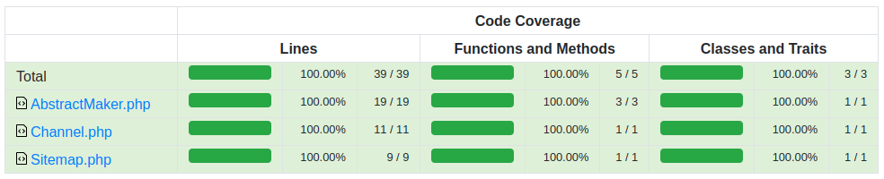

# XmlMaker

With this package you can prepare any xml file: 
rss, sitemap and so on. It will help you make the initial setup. 
For example, set namespaces and 
specify the primary properties of the document.



See more in the [#Tests](#Tests) section.

# Usage

The package is very easy to use.

### Create Sitemap

```php
use Reiterus\XmlMaker\Sitemap;

$sitemap = new Sitemap();

$sitemap
    ->setRootAttributes([
        'xmlns' => 'http://www.sitemaps.org/schemas/sitemap/0.9',
        'xmlns:image' => 'http://www.google.com/schemas/sitemap-image/1.1',
    ])
    ->setDocItems([
        [
            'loc' => 'https://cool.site/normal/product',
            'lastmod' => '2022-05-19T08:10:40+00:00',
            'changefreq' => 'daily',
            'priority' => '0.7',
        ], [
            'loc' => 'https://cool.site/awesome/product',
            'lastmod' => '2022-05-19T08:10:40+00:00',
            'changefreq' => 'daily',
            'priority' => '0.7',
            'image:image' => [
                'image:loc' => 'https://cool.site/awesome/product/image.png',
                'image:title' => 'Your Awesome Product',
            ],
        ],
    ]);

$file = $sitemap->create();
$file->save('maker-sitemap.xml');
```

```xml
<?xml version="1.0" encoding="utf-8"?>
<urlset xmlns="http://www.sitemaps.org/schemas/sitemap/0.9"
        xmlns:image="http://www.google.com/schemas/sitemap-image/1.1">
    <url>
        <loc>https://cool.site/normal/product</loc>
        <lastmod>2022-05-19T08:10:40+00:00</lastmod>
        <changefreq>daily</changefreq>
        <priority>0.7</priority>
    </url>
    <url>
        <loc>https://cool.site/awesome/product</loc>
        <lastmod>2022-05-19T08:10:40+00:00</lastmod>
        <changefreq>daily</changefreq>
        <priority>0.7</priority>
        <image:image>
            <image:loc>https://cool.site/awesome/product/image.png</image:loc>
            <image:title>Your Awesome Product</image:title>
        </image:image>
    </url>
</urlset>
```

### Create RSS channel

```php
use Reiterus\XmlMaker\Channel;

$channel = new Channel();

$channel
    ->setRootAttributes([
        'xmlns:yandex' => 'http://news.yandex.ru',
        'xmlns:media' => 'http://search.yahoo.com/mrss/',
        'xmlns:turbo' => 'http://turbo.yandex.ru',
        'version' => '2.0'
    ])
    ->setChannelProperties([
        'title' => 'Channel Title',
        'link' => 'https://cool.domain',
        'description' => 'Short Channel Description',
        'nested' => [
            'key' => 'value',
        ]
    ])
    ->setDocItems([
        [
            'title' => 'Article 01 Title',
            'link' => 'https://cool.domain/article-01',
            'description' => 'Article 01 Description',
            'pubDate' => 'Sat, 09 Jul 2022 08:56:57 +0000',
        ],[
            'title' => 'Article 02 Title',
            'link' => 'https://cool.domain/article-02',
            'description' => 'Article 02 Description',
            'pubDate' => 'Sun, 29 May 2022 04:02:52 +0000',
        ],
    ]);

$file = $channel->create();
$file->save('maker-rss.xml');
```

```xml
<?xml version="1.0" encoding="utf-8"?>
<rss xmlns:yandex="http://news.yandex.ru"
     xmlns:media="http://search.yahoo.com/mrss/"
     xmlns:turbo="http://turbo.yandex.ru"
     version="2.0">
    <channel>
        <title>Channel Title</title>
        <link>https://cool.domain</link>
        <description>Short Channel Description</description>
        <nested>
            <key>value</key>
        </nested>
        <item>
            <title>Article 01 Title</title>
            <link>https://cool.domain/article-01</link>
            <description>Article 01 Description</description>
            <pubDate>Sat, 09 Jul 2022 08:56:57 +0000</pubDate>
        </item>
        <item>
            <title>Article 02 Title</title>
            <link>https://cool.domain/article-02</link>
            <description>Article 02 Description</description>
            <pubDate>Sun, 29 May 2022 04:02:52 +0000</pubDate>
        </item>
    </channel>
</rss>
```

# Installation
You can install the package in two ways

From packagist.org
```shell
composer require reiterus/xml-maker-native
```

From GitHub repository
```json
{
 "repositories": [
  {
   "type": "vcs",
   "url": "https://github.com/reiterus/xml-maker-native.git"
  }
 ]
}
```

# Tests

To run tests with visual code coverage, launch the command as follows:

```shell
XDEBUG_MODE=coverage ./vendor/phpunit/phpunit/phpunit \
--configuration phpunit.xml \
--testsuite default \
--coverage-html coverage/
```

Test results will be saved in the `coverage` directory.

# License

This library is released under the [MIT license](LICENSE).
